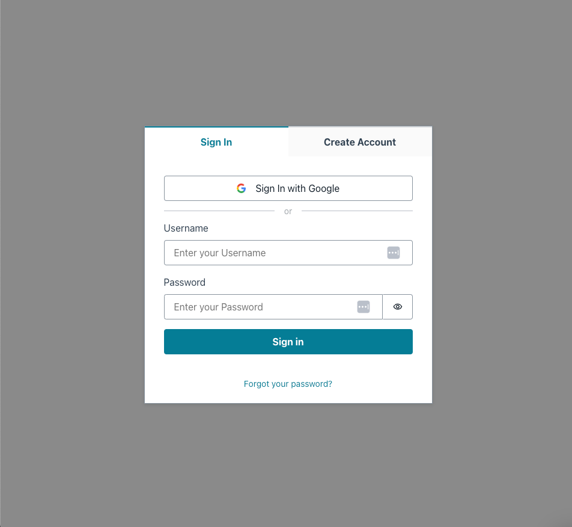
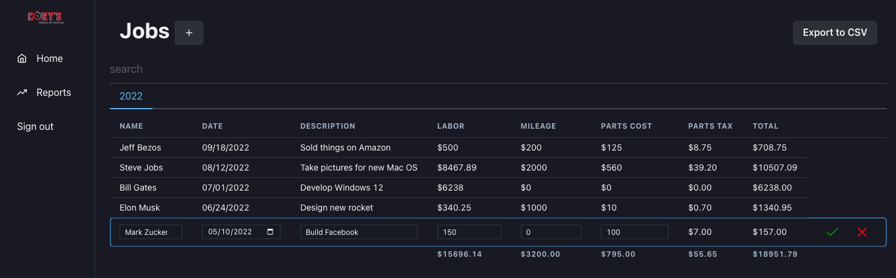

# WorkHorse

This project was built to provide a simple way to track income for my fathers RV repair business.

## Architecture
I used a React/Amplify setup to build out the infrastructure. 

I am using Cognito for user authentication, integrating with Google for an easy sign-in experience.
I have Apollo Client on the frontend communicating with an AppSync GraphQL server to save jobs in DynamoDB.

### Authentication
Using the Amplify SDK we can directly communicate with Cognito for user sign in and registration.

### Functionality
Users are able to create jobs for different customers while the income those jobs provide.
This application was built directly for my dad so we are tracking mileage, parts, and tax.

We are using graphql to create, update, and remove jobs from DynamoDB. Amplify makes everything very easy to configure so setup is a breeze.
I am using React's Context API for state management.
The data is laid out in a table format with virtualized rows and inline actions to update and delete.

